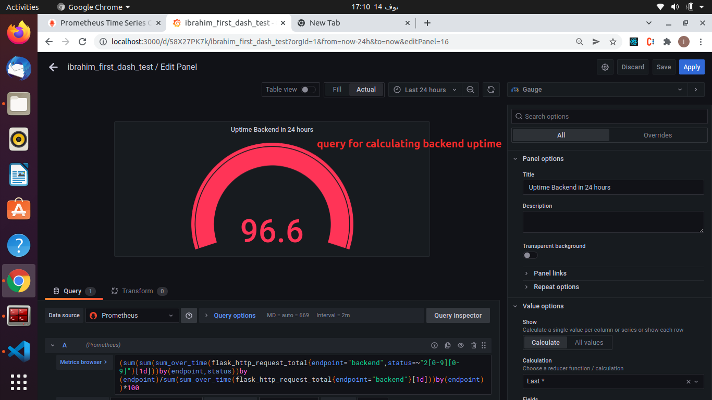
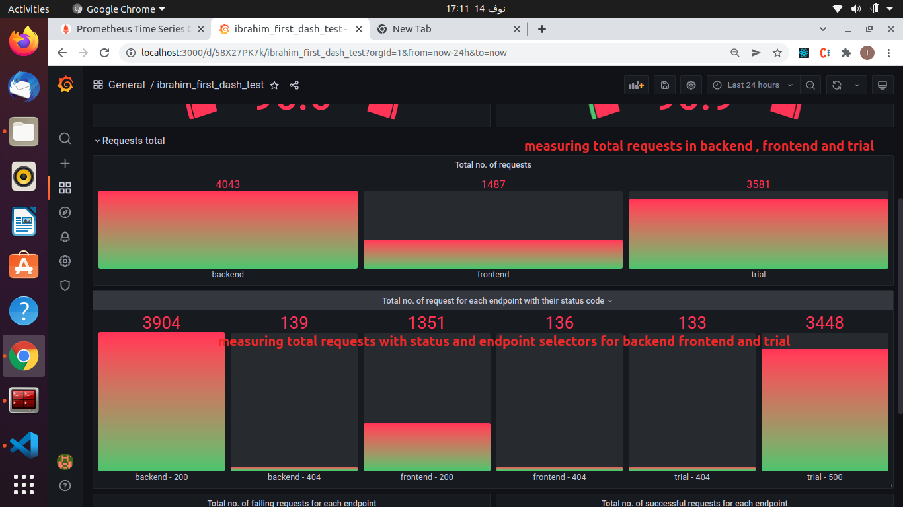
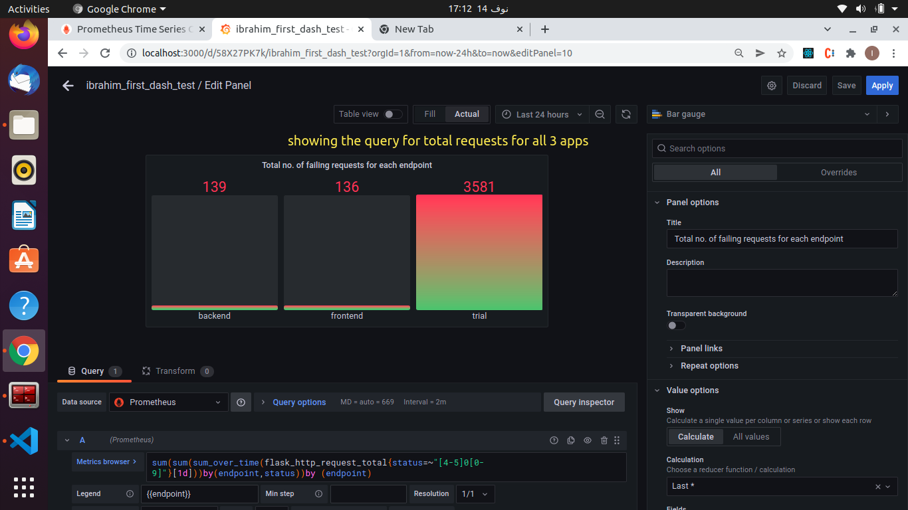
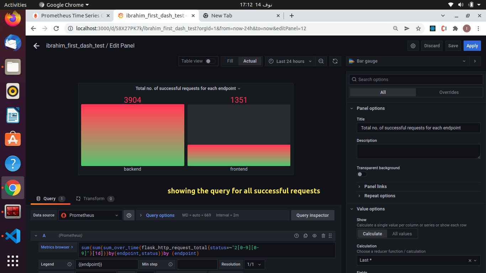
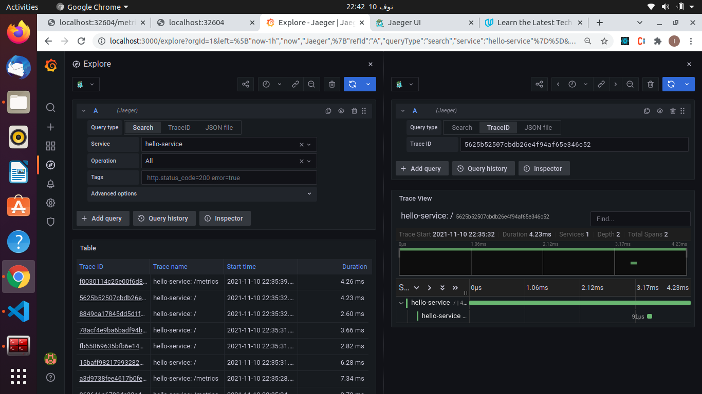

## Submission Details

### Verify the monitoring installation

### Setup the Jaeger and Prometheus source

**Data Source**

### Create a Basic Dashboard

### Describe SLO/SLI
- PS, The answer of this requirement is after my explanation of the **SLO** **SLI** and . I have expatiated to have a detailed reference for me about SLI and SLO.

#### SLO:
- **SLO** stands for _service-level objective_ which is **a specific measurable goal** or goals used to measure **the performance** of a service or an application.
- **SLOs** are always set by **the team** managing the application so they are a **stated objectives** for your team to make sure that **everyone is on the same page** to handle these objectives. 
- Despite of being used on many different factors like database speed or database desk availability,they are usually about **latency and uptime factors**
- **SLOs** are always measured over a period of time **for example:** _"99.99% uptime per month"_
- In the real world, we need to consider  **our users** or **our customers** and the **user journey** when defining our **SLOs** to ensure **a strong customer centric strategy** , a common way to achieve that is by emitating the way our users use our application by going through the same steps our users take while using the application
- We also need to map our journey to services by checking the services involved to complete an action done by the user. 
- We also need to figure out what metrics I should use to see if the services involved are working as expected 
- After finding the metrics and discover how they function we can easily proceed to determine our goals and proceed to formalize them in the SLOs so that the team can have these goal in their charter and work to achieve these goals.

#### SLI
- **SLI** stands for _service level indicators_ which is a specific metric that we use to measure the performance of the service, so **SLIs** are eventually **individual metrics** 
- **Example:** _Time a request takes to complete_ so, if **our SLO** is defined in terms of **latency** like **an SLO of a monthly request response time** then we need to measure the time a request takes to complete with a response and we need an SLI that gives us a measurement values to request response time or like **an SLO of a monthly uptime** then we need to measure how many error messages we can have in a month 
- **SLI charachteristics**, They need to be **INTENTIONAL** meaning that they need to have a purpose like measuring cpu saturation. They need to be **RELEVENT** meaning that they need to match with the stated SLO as any system has many irrelavant metrics that won't serve our SLO and understanding **THE FOUR GOLDEN SIGNALS:latency,traffic errors, and saturation**,helps us to choose the right relevant metrics related to **our SLO**. They also need to be **MEASURABLE** meaning that we can measure to see if you are meeting the goal, _for Example, measuring the amount of milliseconds it takes for a request to complete_. and Finally, They need to **HAVE DIRECT IMPACT** meaning that you choose metrics that will help us improve the overall reliability and performance of our system. 
- Simply speaking, SLIs are measurements for the performance of your system during a specific time to show us weather the system performance level meets the early defined SLO or not and we always use a ratio of a measurement to a given time to indicates that level of performance. 

## Describe SLIs in my own words for a monthly 99.9 uptime SLO

- We need to collect the no. of failing http request in a month, the no.of successful http requests in a month and the no. of total http requests and by dividing the no. of the sucessful http requests and the no of the total http requests then we will be able to Know if the application performance meets our monthly uptime SLO or not. 

## Describe SLIs in my own words for 99.9% of total requests the request response time is less than 5 sec SLO
- we need to collect the total request response time in a month and the no. of http requests in a month and divide them (total request respons time in a month / total no. of http request in a month) that would give us the average request response time and if it is less than 5 sec then the our service meets our SLO or not. 
- we also need to colect the no of requests with request response time is less than 5 sec and the total no. of http requests in a month and substract them and multiply by 100 to get the ratio, if (no.of requests less than 5 sec - no.of total request)*100 is less than 0.01 then the performance of the app is meeting the SLO

### Creating SLI metrics

- **list of 4 SLIs,SlOs based on certain criteria provided in the instructions**

- with an SLO of uptime  

  1. SLO: 99.9 daily uptime  
  2. SLI: total successful http requests a day is more than or equal to 99.9%
  3. SLI: total failing http requests a day is less than or equal to 0.1%

- with an SLO of request response time

  1. SLO: 99.9% daily latency 
  2. SLI: 99.9% of the no. of requstes with response time less than or equal to 5 ms

### Create a Dashboard to measure our Slis

**Frontend and backend uptime**

**Uptime Frontend Query**

**Uptime Backend Query**

**Request Total Part 1**

**Request Total Part 2**

**Request Total Query**

**Request  Total By Endpoint and Status Query**

**Total Request Failing Query**

**Total Request Successful Query**

### Tracing our Flask App

### Jaeger in Dashboards

### Report Error

** Trouble Ticket**

- Name: 4x and 5x Errors
- Date: 14/11/2021
- subject: Uptime is affected
- Affected Area: Backend , frontend , and trial 
- Severity: 1 - A critical incident with very high impact
- Description: Trial app is completely out of service , Backend app : /star path is out of service , front end app  is not able to call backend and trial 

### Creating SLIs and SLOs

1. SLO: All applications has 99.95% uptime per month

2. SLI: Total successful http requests is more than or equal to 99.95% in a month

3. SLI: Total failing http requests is less than or equal to 0.05% in a month

4. SLI: the time of total successful http requests is more than or equal to 99.95%  in  a month

### Building KPIs for our plan 
to create a kpi you need a title for the kpi, a metric, current value and target value 

- For an SLI like Total successful http requests is more than or equal to 99.95% in a month
  1. first KPI is to check if the Total successful http requests is more than or equal to 99.95% on daily basis is more or equal to 99.95
  2. second KPI is to check if the error budget is less than 0.05 on daily basis 

- For an SLI like Total successful http requests is more than or equal to 99.95% in a month
  1. first KPI is to check if the Total failing http requests is less than or equal to 0.05% on daily basis
  2. second KPI is to check if the successful budget is more or equal to  than 99.95% on daily 
- For an SLI like  time of total successful http requests is more than or equal to 99.95%  in  a month
  1. first KPI to check if the total time ratio is more than or equal to 99.95% on daily basis
  2. secont KPI to check if the error budget is less than 0.05 on daily basis. 
  
### Final Dashboard

**New Part**
**KPIs and Uptime for the whole app**

**Repeate**

**Frontend and backend uptime**

**Uptime Frontend Query**

**Uptime Backend Query**

**Request Total Part 1**

**Request Total Part 2**

**Request Total Query**

**Request  Total By Endpoint and Status Query**

**Total Request Failing Query**

**Total Request Successful Query**

