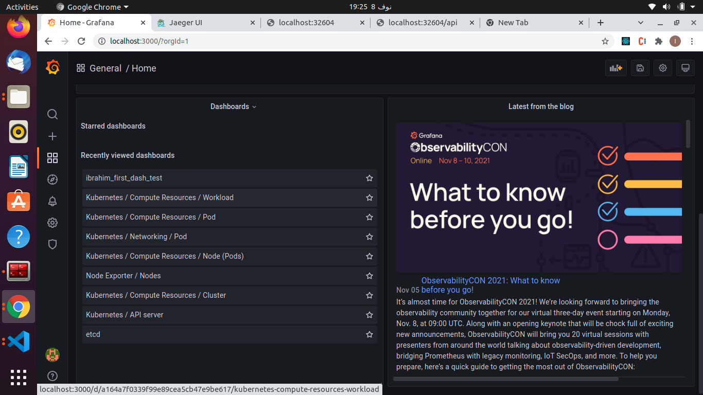

## Submission Details

### Verify the monitoring installation

### Setup the Jaeger and Prometheus source

### Create a Basic Dashboard

### Describe SLO/SLI
- PS, The answer of this requirement[^note] is in the first example in the explanation of the **SLI**. I have expatiated to have a detailed reference for me about SLI and SLO.

#### SLO:
- **SLO** stands for _service-level objective_ which is **a specific measurable goal** or goals used to measure **the performance** of a service or an application.
- **SLOs** are always set by **the team** managing the application so they are a **stated objectives** for your team to make sure that **everyone is on the same page** to handle these objectives. 
- Despite of being used on many different factors like database speed or database desk availability,they are usually about **latency and uptime factors**
- **SLOs** are always measured over a period of time **for example:** _"99.99% uptime per month"_
- In the real world, we need to consider  **our users** or **our customers** and the **user journey** when defining our **SLOs** to ensure **a strong customer centric strategy** , a common way to achieve that is by emitating the way our users use our application by going through the same steps our users take while using the application
- We also need to map our journey to services by checking the services involved to complete an action done by the user. 
- We also need to figure out what metrics I should use to see if the services involved are working as expected 
- After finding the metrics and discover how they function we can easily proceed to determine our goals and proceed to formalize them in the SLOs so that the team can have these goal in their charter and work to achieve these goals.

#### SLI
- **SLI** stands for _service level indicators_ which is a specific metric that we use to measure the performance of the service, so **SLIs** are eventually **individual metrics** 
- [^note]**Example:** _Time a request takes to complete_ so, if **our SLO** is defined in terms of **latency** like **an SLO of a monthly request response time** then we need to measure the time a request takes to complete with a response and we need an SLI that gives us a measurement values to request response time or like **an SLO of a monthly uptime** then we need to measure how many error messages we can have in a month 
- **SLI charachteristics**, They need to be **INTENTIONAL** meaning that they need to have a purpose like measuring cpu saturation. They need to be **RELEVENT** meaning that they need to match with the stated SLO as any system has many irrelavant metrics that won't serve our SLO and understanding **THE FOUR GOLDEN SIGNALS:latency,traffic errors, and saturation**,helps us to choose the right relevant metrics related to **our SLO**. They also need to be **MEASURABLE** meaning that we can measure to see if you are meeting the goal, _for Example, measuring the amount of milliseconds it takes for a request to complete_. and Finally, They need to **HAVE DIRECT IMPACT** meaning that you choose metrics that will help us improve the overall reliability and performance of our system. 
- Simply speaking, SLIs are measurements for the performance of your system during a specific time to show us weather the system performance level meets the early defined SLO or not and we always use a ratio of a measurement to a given time to indicates that level of performance. 

### Creating SLI metrics

- **5 certain metrics**

- with an SLO of 99.9 uptime in a month we need these slis
  1. no. of failing http request in a day as showing the daily failing request counter will give us a good indicator
  2. no. of successful http request in a day comparing with the failing request we will get more understanding 
  3. no. of total requests in a day 
  4. failing http request total time in a month
  5. successful http total time request in a month
  note using this simple equation **(total successful time / total failing time + total successful time) %** this  gives us the total uptime for our applications in a specified period.

### Create a Dashboard to measure our Slis

### Tracing our Flask App

### Jaeger in Dashboards

